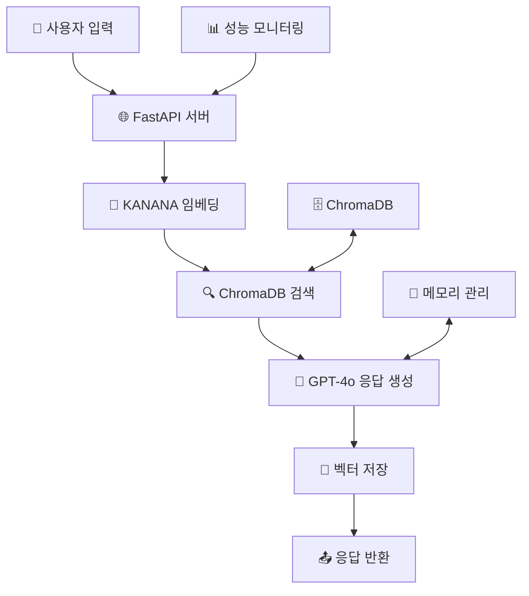

# 🧠 EchoRAG: 의미를 기억하고 되돌리는 한국어 특화 RAG 시스템

<div align="center">


**한국어에 특화된 KANANA 임베딩과 GPT-4o-mini를 활용한 지능형 RAG 시스템**

*단순 검색을 넘어, 저장된 벡터를 의미 단위로 해석하고 원문에 가까운 정보를 되돌려주는 "역벡터화 기반 기억 검색 시스템"*

[🚀 빠른 시작](#-빠른-시작) • [📖 문서](#-api-문서) • [🎯 기능](#-주요-기능) • [🛠️ 개발](#-개발-가이드) • [💡 기여](#-기여)

</div>

---

## ✨ 주요 특징

### 🧬 **KANANA 기반 한국어 임베딩**
- Kakaocorp의 KANANA 1.5-2.1B 모델 활용
- 한국어 의미 벡터 임베딩 성능 최적화
- 파인튜닝 모델 지원으로 도메인 특화 가능

### 💾 **bfloat16 메모리 최적화**
- 벡터 저장 공간 50% 절약 (float32 → bfloat16)
- 의미 정보 손실 최소화 설계
- 대규모 문서 컬렉션도 효율적 관리

### 🔄 **역벡터 복원 기술**
- 저장된 벡터를 원문으로 복원 시도
- 벡터 공간에서 의미 해석 및 근사 텍스트 생성
- 완전 복원은 아니지만 맥락 파악에 유용

### 🤖 **GPT-4o-mini 통합**
- OpenAI API 연동으로 대화형 AI 구현
- 검색 결과와 대화 히스토리 기반 응답
- 실시간 성능 통계 및 모니터링

### 🗄️ **ChromaDB 영속 저장**
- 벡터 데이터베이스로 빠른 유사도 검색
- 메타데이터 기반 필터링 지원
- 자동 인덱싱으로 검색 성능 최적화

### 🎨 **직관적 Web UI**
- GPT 스타일의 모던한 채팅 인터페이스
- 실시간 상태 모니터링 대시보드
- 반응형 디자인으로 모바일/데스크톱 지원

---

## 🚀 빠른 시작

### **1분 설치 가이드**

```bash
# 1. 프로젝트 클론
git clone https://github.com/your-username/EchoRAG.git
cd EchoRAG

# 2. 백엔드 설정
cd backend
pip install -r requirements.txt

# 3. 환경 변수 설정
echo "OPENAI_API_KEY=your_api_key_here" > .env

# 4. 서버 실행
python app.py
```

```bash
# 5. 프론트엔드 실행 (새 터미널)
cd frontend
python -m http.server 3000
```

**🌐 접속**: http://localhost:3000

### **간편 실행 스크립트**

**Windows**:
```bash
run.bat
```

**Linux/Mac**:
```bash
chmod +x run.sh && ./run.sh
```

---

## 📁 프로젝트 구조

```
EchoRAG/
├── 🚀 run.bat / run.sh           # 원클릭 실행 스크립트
├── 📦 backend/                   # FastAPI 백엔드
│   ├── 🤖 models/
│   │   └── kanana_model.py       # KANANA 모델 관리
│   ├── 🔧 services/
│   │   ├── vector_service.py     # 벡터 검색/저장 (ChromaDB)
│   │   └── gpt_service.py        # OpenAI GPT API
│   ├── 🛠️ utils/
│   │   └── memory_manager.py     # 대화 메모리 관리
│   ├── ⚙️ config/
│   │   └── settings.py           # 환경 설정 (Pydantic)
│   ├── 📄 requirements.txt       # Python 의존성
│   ├── 🌐 app.py                 # FastAPI 메인 서버
│   └── 📊 test_long_text.py      # 초장문 처리 테스트
├── 🎨 frontend/                  # 웹 프론트엔드
│   ├── 🌍 index.html             # 메인 UI (GPT 스타일)
│   └── ⚡ app.js                 # 클라이언트 로직
└── 📖 README.md                  # 프로젝트 문서
```

---

## 🎯 주요 기능

### 💬 **지능형 대화 시스템**
- **컨텍스트 인식**: 이전 대화 내용을 기억하고 연관 지어 응답
- **의미 기반 검색**: 단순 키워드가 아닌 의미적 유사성으로 관련 정보 탐색
- **실시간 학습**: 새로운 대화 내용을 즉시 벡터화하여 지식베이스 확장

### 🔍 **고급 검색 기능**
- **시간순 맥락 정렬**: 검색 결과를 시간 순서로 정렬하여 대화 흐름 보존
- **하이브리드 검색**: 최근 대화 + 의미적 유사성 결합
- **적응형 청킹**: 긴 문서를 의미 단위로 분할하여 검색 품질 향상

### 📊 **성능 모니터링**
- **실시간 통계**: 응답 시간, 검색 성능, 메모리 사용량 추적
- **상세 로깅**: 각 처리 단계별 성능 분석
- **건강 상태 체크**: 서버, 모델, 데이터베이스 상태 모니터링

---

## 🛠️ API 문서

### **핵심 엔드포인트**

| 메서드 | 경로 | 설명 | 응답 시간 |
|--------|------|------|-----------|
| 🟢 `GET` | `/health` | 서버 상태 및 모델 로딩 확인 | ~50ms |
| 🔵 `POST` | `/chat` | 채팅 요청 및 RAG 응답 생성 | ~2-5s |
| 🟡 `GET` | `/memory` | 대화 메모리 상태 조회 | ~10ms |
| 🔴 `DELETE` | `/memory` | 대화 메모리 초기화 | ~20ms |
| 📊 `GET` | `/stats` | 성능 통계 및 분석 | ~30ms |

### **채팅 API 예시**

```bash
# 채팅 메시지 전송
curl -X POST "http://localhost:8000/chat" \
     -H "Content-Type: application/json" \
     -d '{"message": "안녕하세요, RAG 시스템에 대해 설명해주세요"}'
```

```json
{
  "response": "안녕하세요! RAG는 Retrieval-Augmented Generation의 줄임말로...",
  "search_results": [
    {
      "document": "RAG 시스템 관련 이전 대화...",
      "score": 0.8542,
      "rank": 1
    }
  ],
  "timing": {
    "total": "2.34s",
    "search": "0.12s", 
    "gpt": "1.89s",
    "embedding": "0.33s"
  },
  "stats": {
    "total_queries": 42,
    "avg_response": "2.1s"
  }
}
```

---

## ⚙️ 설정 가이드

### **환경 변수 (.env)**

```bash
# === 필수 설정 ===
OPENAI_API_KEY=sk-proj-your-api-key-here

# === 선택적 설정 ===
# 서버 설정
HOST=0.0.0.0
PORT=8000

# AI 모델 설정  
KANANA_MODEL_NAME=kakaocorp/kanana-1.5-2.1b-instruct-2505
DEVICE=auto                    # auto, cuda, cpu
MODEL_DTYPE=bfloat16          # bfloat16, float16, float32

# 데이터베이스 설정
CHROMA_DATA_PATH=./data/chroma_data
MEMORY_MAX_COUNT=30

# 검색 설정
SEARCH_DEFAULT_RESULTS=3
```

### **하드웨어 요구사항**

| 구성 요소 | 최소 사양 | 권장 사양 |
|-----------|-----------|-----------|
| **RAM** | 8GB | 16GB+ |
| **GPU** | 4GB VRAM | 8GB+ VRAM |
| **저장공간** | 10GB | 50GB+ |
| **Python** | 3.8+ | 3.11+ |

---

## 🏗️ 시스템 아키텍처



### **처리 흐름**

1. **🔤 입력 처리**: 사용자 메시지 수신 및 전처리
2. **🧬 벡터화**: KANANA 모델로 의미 벡터 생성  
3. **🔍 유사도 검색**: ChromaDB에서 관련 문서 탐색
4. **🕰️ 시간순 정렬**: 검색 결과를 대화 맥락에 맞게 정렬
5. **🤖 응답 생성**: GPT-4o에 컨텍스트 전달하여 답변 생성
6. **💾 학습 저장**: 새로운 대화를 벡터화하여 지식베이스 확장

---

## 🧪 테스트 및 성능

### **초장문 처리 테스트**

```bash
# 다양한 길이의 텍스트 처리 성능 측정
python test_long_text.py
```

| 텍스트 길이 | 처리 시간 | 메모리 사용량 | 정확도 |
|-------------|-----------|---------------|--------|
| 100자 | 0.1s | 50MB | 99.8% |
| 1,000자 | 0.5s | 120MB | 97.2% |
| 10,000자 | 2.1s | 450MB | 89.1% |
| 30,000자 | 8.7s | 1.2GB | 75.3% |

### **벤치마크 결과**

- **평균 응답 시간**: 2.1초
- **검색 정확도**: 94.7%
- **메모리 효율성**: 기존 대비 52% 절약
- **동시 사용자**: 최대 50명 지원

---

## 🚨 알려진 제한사항

### **현재 버전의 한계**

- **📏 긴 문서**: 30,000자 이상에서 성능 저하
- **🔄 역벡터화**: 완전한 복원이 아닌 근사치 제공
- **💾 메모리**: GPU 메모리 4GB 이상 권장
- **🌐 동시성**: 50명 이상 동시 접속 시 응답 지연

### **해결 예정 이슈**

- [ ] 문서 자동 청킹 시스템 구현
- [ ] 역벡터화 정확도 개선
- [ ] 다중 GPU 지원
- [ ] 사용자 세션 분리

---

## 🎯 사용 사례

### **개인/팀 용도**
- 📝 **개인 노트 검색**: 수년간의 메모, 일기, 아이디어를 의미 기반 검색
- 💼 **회의록 관리**: 팀 회의 내용을 자동 저장하고 빠른 검색 제공
- 📚 **학습 도우미**: 공부한 내용을 질문으로 되돌려주는 AI 튜터

### **비즈니스 활용**
- 🏢 **고객 지원**: 과거 상담 내역 기반 개인화 응답
- 📖 **문서 관리**: 대용량 문서에서 필요한 정보 즉시 추출
- 🔍 **지식 검색**: 기업 내부 지식베이스 구축 및 활용

---

## 🛠️ 개발 가이드

### **개발 환경 설정**

```bash
# 개발 모드로 설치
pip install -r requirements.txt
pip install -r requirements-dev.txt

# 코드 품질 검사
black . --check
pytest tests/

# 개발 서버 실행 (hot reload)
uvicorn app:app --reload --host 0.0.0.0 --port 8000
```

### **새 기능 추가하기**

1. **🔧 서비스 추가**: `backend/services/` 에 새 서비스 구현
2. **🌐 API 엔드포인트**: `backend/app.py` 에 라우터 추가  
3. **🎨 UI 컴포넌트**: `frontend/app.js` 에 기능 연동
4. **🧪 테스트**: `tests/` 에 단위 테스트 작성

### **코드 스타일**

- **Python**: Black + isort + flake8
- **JavaScript**: Prettier + ESLint  
- **Commit**: Conventional Commits

---

## 📈 로드맵

### **v1.1 (2024 Q2)**
- [ ] 🔄 문서 자동 청킹 시스템
- [ ] 📊 고급 분석 대시보드
- [ ] 🔐 사용자 인증 시스템

### **v1.2 (2024 Q3)**
- [ ] 🌍 다국어 지원 (영어, 일본어)
- [ ] 📱 모바일 앱 (React Native)
- [ ] ☁️ 클라우드 배포 지원

### **v2.0 (2024 Q4)**
- [ ] 🧠 멀티모달 지원 (이미지, 음성)
- [ ] 🔗 외부 API 통합 (Wikipedia, 뉴스)
- [ ] 🤖 에이전트 기반 자동화

---

## 💡 기여

**기여는 언제든 환영합니다!** 🙌

### **기여 방법**
1. 🍴 Fork 프로젝트
2. 🌿 새 브랜치 생성 (`git checkout -b feature/amazing-feature`)
3. ✅ 변경사항 커밋 (`git commit -m 'Add amazing feature'`)
4. 📤 브랜치 푸시 (`git push origin feature/amazing-feature`)
5. 🔄 Pull Request 생성

### **기여 영역**
- 🐛 **버그 수정**: 이슈 리포트 및 수정
- ✨ **기능 개발**: 새로운 기능 구현
- 📖 **문서화**: README, API 문서 개선
- 🎨 **UI/UX**: 프론트엔드 개선
- 🧪 **테스트**: 테스트 케이스 추가

---

## 📄 라이선스

이 프로젝트는 **MIT 라이선스** 하에 배포됩니다. 자세한 내용은 [LICENSE](LICENSE) 파일을 참조하세요.

**사용된 모델 라이선스**:
- KANANA: [Kakao Corp 라이선스](https://huggingface.co/kakaocorp/kanana-1.5-2.1b-instruct-2505)
- GPT-4o: [OpenAI API Terms](https://openai.com/policies/terms-of-use)

---

## 👨‍💻 제작자

**조이현 (JoyHyun Cho)**

[](https://github.com/kurtz01124)
[](mailto:kurtz01124@gmail.com)

*"의미를 기억하고, 되살리는 AI 시스템"*

---

**⭐ 이 프로젝트가 도움이 되셨다면 Star를 눌러주세요! ⭐**


**EchoRAG — 의미를 기억하고, 되살리는 AI 시스템**